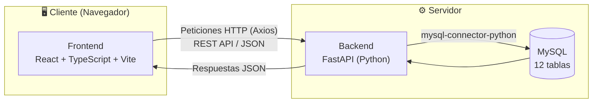
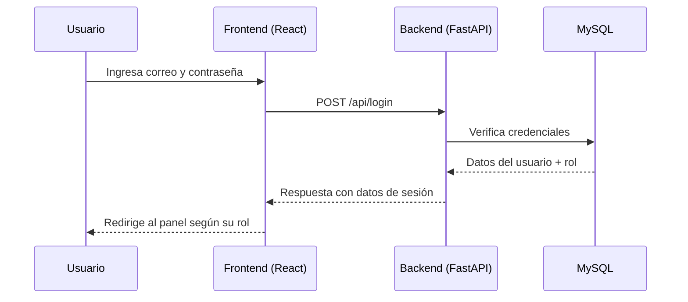

# 🏗️ Arquitectura del Sistema — Globde

[⬅ Volver al README principal](../../README.md)

---

## Patrón arquitectónico

Globde está construido bajo el patrón **Modelo–Vista–Controlador (MVC)**, separando:

- **Modelo** → tablas y datos en MySQL, accedidos desde el backend.
- **Vista** → interfaz de usuario en React (frontend).
- **Controlador** → endpoints de FastAPI que reciben las peticiones, aplican la lógica y devuelven respuestas.

## Diagrama general



## Flujo de autenticación



## Organización de carpetas

```
GLOBDE/
├── frontend/     # React + TypeScript + Vite
├── backend/      # FastAPI + Python
├── database/     # Script SQL de la base de datos
└── docs/         # Documentación del proyecto
```

## Comunicación Frontend ↔ Backend

- El frontend consume la API mediante **Axios** (`frontend/src/api/axiosClient.ts` y `globdeApi.ts`).
- El estado de sesión y datos globales se manejan con **Redux** (`frontend/src/store/`), incluyendo persistencia en `localStorage` para mantener la sesión activa.
- El backend expone endpoints REST bajo el prefijo `/api/` (ver [`api-endpoints.md`](api-endpoints.md)).
- CORS está habilitado en el backend para permitir la comunicación entre `localhost:5173` (frontend) y `localhost:8000` (backend) en desarrollo.

## Roles del sistema

| ID de rol | Rol | Acceso |
|---|---|---|
| 1 | Administrador | Gestión completa del sistema |
| 2 | Barbero | Agenda, citas y disponibilidad propias |
| 3 | Cliente | Reservas, historial y perfil propio |

---

[⬅ Volver al README principal](../../README.md)
