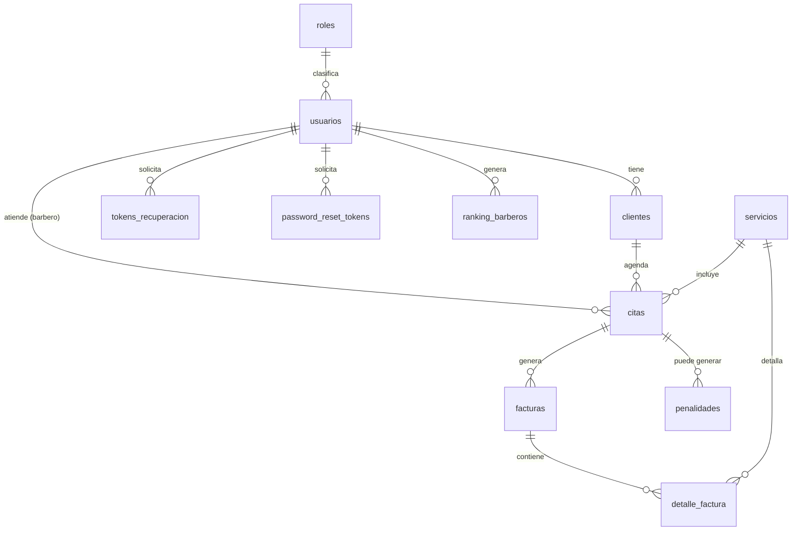

# 🗄️ Esquema de Base de Datos — Globde

[⬅ Volver al README principal](../../README.md)

Base de datos en **MySQL**, definida en [`database/database.sql`](../../database/database.sql).
Actualmente cuenta con **12 tablas**.

---

## Diagrama Entidad-Relación (simplificado)

---

## Detalle de tablas

### `catalogo_cortes`

Galería de estilos de corte disponibles para mostrar a los clientes.

| Columna | Tipo | Not Null | Clave |
|---|---|---|---|
| `id_corte` | int | Sí | 🔑 PK |
| `nombre` | varchar(100) | Sí |  |
| `descripcion` | varchar(255) | Sí |  |
| `imagen_url` | varchar(255) | Sí |  |

### `citas`

Citas agendadas, con cliente, barbero, servicio, fecha, hora y estado.

| Columna | Tipo | Not Null | Clave |
|---|---|---|---|
| `id_cita` | int | Sí | 🔑 PK |
| `id_cliente` | int | Sí | 🔗 FK → `clientes` |
| `id_usuario` | int | Sí | 🔗 FK → `usuarios` |
| `id_servicio` | int | Sí | 🔗 FK → `servicios` |
| `fecha` | date | Sí |  |
| `hora` | time | Sí |  |
| `estado` | enum(...) | Sí |  |
| `observaciones` | text | No |  |

### `clientes`

Datos de contacto adicionales de los clientes, vinculados a un usuario.

| Columna | Tipo | Not Null | Clave |
|---|---|---|---|
| `id_cliente` | int | Sí | 🔑 PK |
| `id_usuario` | int | Sí | 🔗 FK → `usuarios` |
| `nombre` | varchar(100) | Sí |  |
| `telefono` | varchar(20) | Sí |  |
| `correo` | varchar(150) | Sí |  |
| `fecha_registro` | date | Sí |  |
| `puntaje` | int | Sí |  |

### `detalle_factura`

Detalle de servicios incluidos en cada factura.

| Columna | Tipo | Not Null | Clave |
|---|---|---|---|
| `id_detalle` | int | Sí | 🔑 PK |
| `id_factura` | int | Sí | 🔗 FK → `facturas` |
| `id_servicio` | int | Sí | 🔗 FK → `servicios` |
| `precio` | decimal(10,2),2) | Sí |  |

### `facturas`

Facturación generada a partir de una cita completada.

| Columna | Tipo | Not Null | Clave |
|---|---|---|---|
| `id_factura` | int | Sí | 🔑 PK |
| `id_cita` | int | Sí | 🔗 FK → `citas` |
| `total` | decimal(10,2),2) | Sí |  |
| `fecha` | date | Sí |  |

### `password_reset_tokens`

Tokens para el flujo de recuperación de contraseña (versión alterna en inglés).

| Columna | Tipo | Not Null | Clave |
|---|---|---|---|
| `id_token` | int | Sí | 🔑 PK |
| `id_usuario` | int | Sí | 🔗 FK → `usuarios` |
| `token_hash` | varchar(64) | Sí |  |
| `expires_at` | datetime | Sí |  |
| `used` | tinyint | No |  |
| `created_at` | datetime | No |  |

### `penalidades`

Registro de penalidades aplicadas por cancelaciones tardías u otras faltas.

| Columna | Tipo | Not Null | Clave |
|---|---|---|---|
| `id_penalidad` | int | Sí | 🔑 PK |
| `id_cita` | int | Sí | 🔗 FK → `citas` |
| `id_usuario` | int | Sí | 🔗 FK → `usuarios` |
| `motivo` | varchar(255) | Sí |  |
| `valor` | decimal(10,2),2) | Sí |  |
| `fecha` | date | Sí |  |

### `ranking_barberos`

Métricas de desempeño y ranking de cada barbero.

| Columna | Tipo | Not Null | Clave |
|---|---|---|---|
| `id_ranking` | int | Sí | 🔑 PK |
| `id_usuario` | int | Sí | 🔗 FK → `usuarios` |
| `nivel` | varchar(50) | Sí |  |
| `porcentaje_incremento` | decimal(5,2) | Sí |  |
| `total_citas` | int | Sí |  |

### `roles`

Catálogo de roles disponibles: Administrador, Barbero, Cliente.

| Columna | Tipo | Not Null | Clave |
|---|---|---|---|
| `id_rol` | int | Sí | 🔑 PK |
| `nombre` | varchar(50) | Sí |  |
| `descripcion` | varchar(150) | Sí |  |

### `servicios`

Catálogo de servicios que ofrece la barbería (precio, duración, estado activo/inactivo).

| Columna | Tipo | Not Null | Clave |
|---|---|---|---|
| `id_servicio` | int | Sí | 🔑 PK |
| `nombre` | varchar(100) | Sí |  |
| `descripcion` | varchar(255) | Sí |  |
| `precio` | decimal(10,2),2) | Sí |  |
| `duracion_minutos` | int | Sí |  |
| `activo` | tinyint(1) | Sí |  |

### `tokens_recuperacion`

Tokens para el flujo de recuperación de contraseña (versión en español).

| Columna | Tipo | Not Null | Clave |
|---|---|---|---|
| `id_token` | int | Sí | 🔑 PK |
| `id_usuario` | int | Sí | 🔗 FK → `usuarios` |
| `token` | varchar(255) | Sí |  |
| `expiracion` | datetime | Sí |  |
| `usado` | tinyint(1) | Sí |  |
| `fecha_envio` | datetime | Sí |  |

### `usuarios`

Cuentas del sistema (administradores, barberos y clientes), con su rol asignado.

| Columna | Tipo | Not Null | Clave |
|---|---|---|---|
| `id_usuario` | int | Sí | 🔑 PK |
| `nombre` | varchar(100) | Sí |  |
| `correo` | varchar(150) | Sí |  |
| `contrasena` | varchar(255) | Sí |  |
| `telefono` | varchar(20) | Sí |  |
| `id_rol` | int | Sí | 🔗 FK → `roles` |
| `activo` | tinyint(1) | Sí |  |
| `fecha_creacion` | date | Sí |  |

---

[⬅ Volver al README principal](../../README.md)
