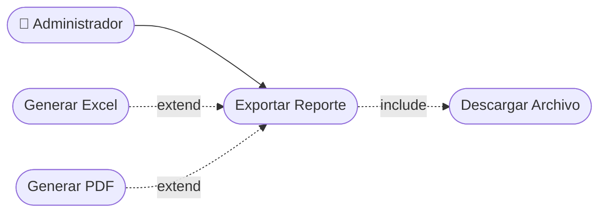

# CU-32 — Exportación de Reportes

[⬅ Volver al README principal](../../../README.md)

---

## Identificación

| Campo | Valor |
|---|---|
| **ID** | CU-32 |
| **Historia de Usuario asociada** | [HU-32](../HUs/) |
| **Módulo** | Reportes Administrativos |
| **Actores** | Administrador |

---

## Descripción

Permite al administrador exportar los reportes generados en formato Excel o PDF para compartirlos fuera del sistema o archivarlos.

## Precondiciones

- Debe haberse generado un reporte en el sistema.
- El administrador debe haber iniciado sesión.

## Postcondiciones

- El archivo es generado y descargado en el formato seleccionado.
- El sistema registra la exportación realizada.

## Secuencia Normal

| # | Acción (actor) | Reacción (sistema) |
|---|---|---|
| 1 | El administrador genera un reporte en el sistema. | El sistema muestra los resultados del reporte generado. |
| 2 | El administrador selecciona el formato de exportación (Excel o PDF). | El sistema genera el archivo en el formato indicado. |
| 3 | El sistema inicia la descarga automáticamente. | El administrador recibe el archivo descargado en su dispositivo. |

## Excepciones

| # | Acción (actor) | Reacción (sistema) |
|---|---|---|
| p | El reporte no tiene datos para exportar. | El sistema muestra: "No hay datos disponibles para exportar". |
| q | El formato seleccionado falla al generarse. | El sistema muestra un error y ofrece intentar de nuevo. |

## Rendimiento

El archivo debe generarse y descargarse en menos de 5 segundos.

## Frecuencia de uso

Se realiza periódicamente para respaldar o compartir información del negocio.

## Diagrama de Caso de Uso

---

[⬅ Volver al README principal](../../../README.md)
